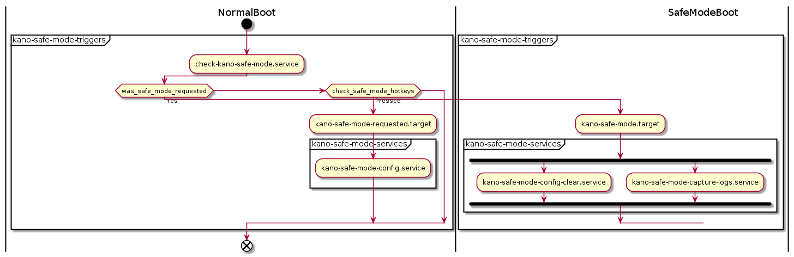
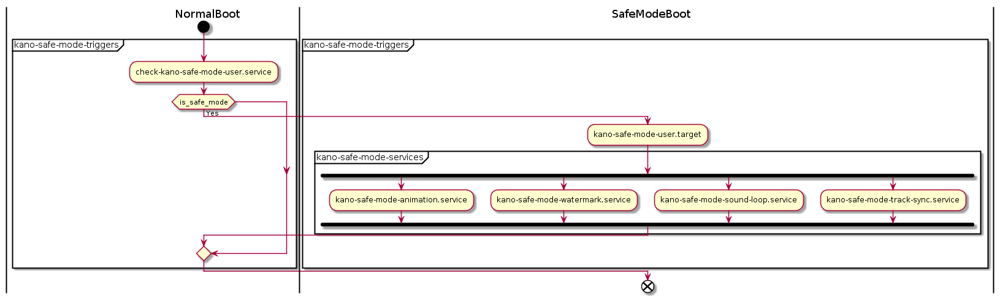

# kano-safe-mode

The **kano-safe-mode** package is split into three subpackages:

  - **kano-safe-mode-services** is the highest level package. It contains all the services that get triggered before and during Safe Mode that change the system in any way.
  - **kano-safe-mode-triggers** contains systemd targets which your services should link with: 
    - kano-safe-mode-requested.target 
    - kano-safe-mode.target
    - kano-safe-mode-user.target
  - **libkano-safe-mode** provides functionality to interact with Kano Safe Mode. Currently, it only contains a function to tell whether the current boot is in Safe Mode.

The two packages contain both system and user services / targets.

## Safe Mode System Services 

When the OS boots, **check-kano-safe-mode.service** starts right after the boot splash shows and it will either wait for users to press **CTRL** + **ALT** keys and register a Safe Mode boot request or it will process such a previous request and boot into Safe Mode.

When Safe Mode is requested, **kano-safe-mode-requested.target** is started. Services which need to apply system configuration that require a reboot to take effect should depend on this target. The system will wait for all such services to finish and will then reboot.

When booting into Safe Mode, **kano-safe-mode.target** is started. Services that ran previously should depend on this target to clear any configuration made for the next clean boot. System configuration that can be applied on the same boot should depend on this target (since there are none at this point, a **kano-safe-mode-clear.target** does not currently exist). Other system services that are not appropriate in user space should also depend on this target.

## Safe Mode User Services

After a user logs in (or is auto logged in) during Safe Mode, **check-kano-safe-mode-user.service** starts and will raise the **kano-safe-mode-user.target**. Services that want to react to this from user space should depend on this target.
